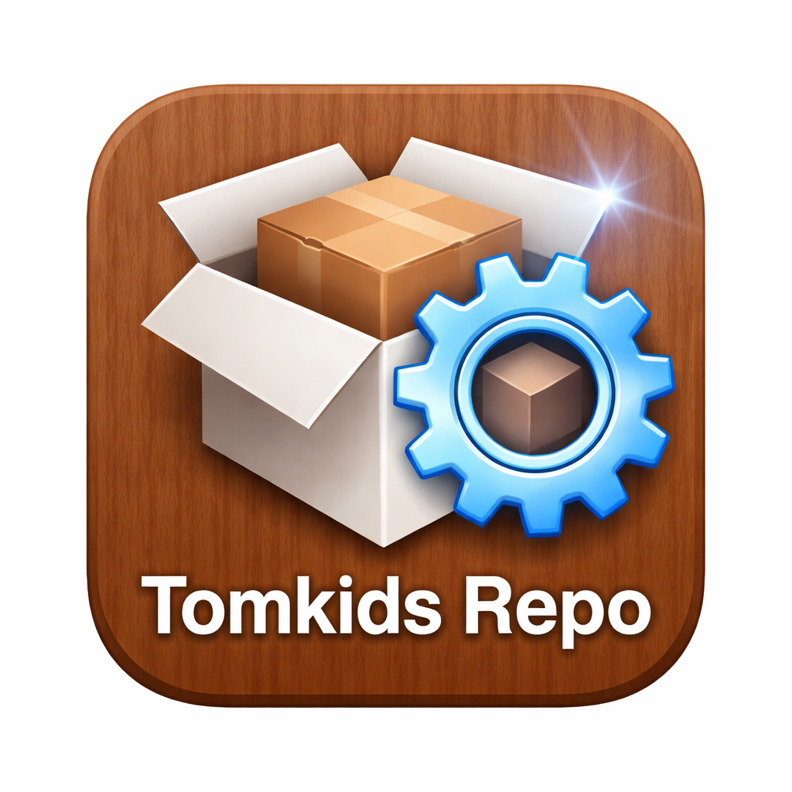

<!DOCTYPE html>
<html lang="en">
<head>
<meta charset="UTF-8">
<meta name="viewport" content="width=device-width, initial-scale=1.0">

</head>

<body>

<header>

<h1>Tomkids Repo</h1>

Classic Jailbreak Repository

 

for iOS 5 • iOS 6 • iOS 7 • iOS 8 • iOS 9 • iOS 10

<a href="https://tomkidsrepo.cloud/" style="color: inherit; text-decoration: none;">https://tomkidsrepo.cloud/</a>

<a class="btn primary"
href="cydia://url/https://cydia.saurik.com/api/share#?source=https://tomkidsrepo.cloud/">

Thêm vào Cydia

</a>

<a class="btn secondary"
href="sileo://source/https://tomkidsrepo.cloud/">

Thêm vào Sileo

</a>

<a class="btn secondary"
href="zbra://sources/add/https://tomkidsrepo.cloud/">

Thêm vào Zebra

</a>

</header>

<section class="cards">

<h2>100+</h2>

Packages

<h2>iOS 6</h2>

Primary Target

<h2>ARM</h2>

iphoneos-arm

</section>

<section class="info">

<h2>About</h2>

Tomkids Repo is a repository dedicated to preserving classic jailbreak tweaks,

utilities, applications and system packages for legacy iOS devices.

 

The packages are collected from various sources and built from IPA files.

 

Repository URL:

 

<b>

https://tomkidsrepo.cloud/

</b>

</section>

© 2026 Tomkids Repo

</body>

</html>
